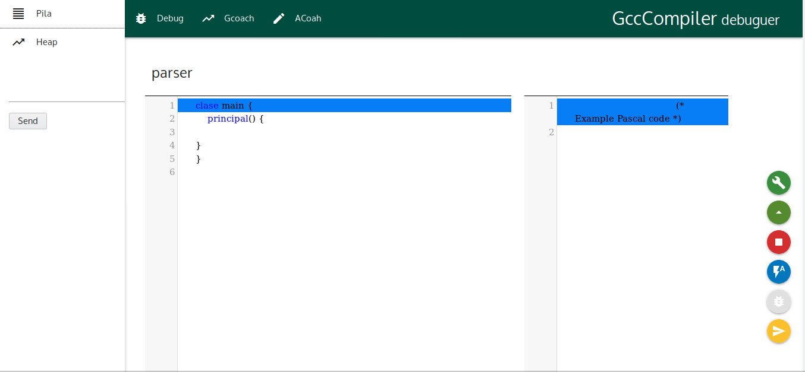

# TallerTypescript

## ¿Qué es Typescript?

En palabras simples es un trans compilador de lenguaje de objetos a JavaScript, que es una solución de desarrollo que nos ha brindado Microsoft, la razón porque es Open Source.

## Microsoft lo llama superset

Typescript es un superset de JavaScript. Decimos que una tecnología es un superset de un lenguaje de programación, cuando puede ejecutar programas de la tecnología, Typescript en este caso, y del lenguaje del que es el superset, JavaScript en este mismo ejemplo. En resumen, esto significa que los programas de JavaScript son programas válidos de TypeScript, a pesar de que TypeScript sea otro lenguaje de programación.

Fuente:
Codigo Facilito ,Typescript<https://codigofacilito.com/articulos/typescript>

## Ventajas

* Revision de Tipado Estatico.
* Debuger.
* Diseñado para aplicaciones grandes.
* Orientada a Objetos.
* ES6.

# Requisitos

### Node && NPM

````
https://nodejs.org/en/download/package-manager/

````

### Visual Studio Code
### Type Script

````
npm i typescript -g
````
### Nodemon

Escucha los cambios en el servidor

````
npm i nodemon -d
````
### types

Es la manera que typescript entiende bibliotecas que no estran escrictas en typescript
````
npm i @types/node -d
````
### Concurrently

Funciona para ejecutar dos comandos en node.

````
npm i concurrently -d
````

### Express

````
npm i express -d
````

# Iniciar con Typescript

Al terminar la instalacion es necesario configurar el entorno de trabajo

````
tsc --init
````

gera un archivo para la configuración del entorno de desarrollo 
para esto descomentamos 
````
  - "sourceMap": true
  - "outDir": "dist/"
  - "rootDir": "src/"
````

ahora agregamos el entorno

````
  "include": [
    "src/**/*"
  ],
  "exclude": [
    "node_modules",
    "dist"
  ]
````

# Sintaxis Básica 

## variables

````
declaracion -> let .
declaracion -> var .

variable -> declaracion nombreVariable : tipoDeVariable ; .
variable -> declaracion nombreVariable : tipoDeVariable = valor; .
````
* ejemplo:
````ts
var num = 1.555;
````

## Objetos

````
objeto -> declaracion nombreVariable : listaTipos } = listaObejtos}.

listaTipos ->  { nombreVariable : tipoDeVariable .
listaTipos ->  listaTipos, nombreVariable : tipoDeVariable .

listaObejtos -> { nombreVariable : Valor .
listaObejtos -> listaObejtos, nombreVariable : Valor .
````

* ejemplo:
```` ts
let obj: {nombre:string, edad:number, abilidad:string[]} ={
  nombre:"luis",
  edad:24,
  abilidad:["hablar en publico"]
}
````

## Crear Tipado personalizado

buena practica colocarlo con mayuscula

````
nuevoTipo -> type nombreTipo = listaTipos .

````
* ejemplo:
````ts
type Heroe = {nombre:string, edad:number, abilidad:string[]}

let lui: Heroe ={
  nombre:"luis",
  edad:24,
  abilidad:["hablar en publico"]
}

````
## Clases 

````ts
class Alumno {
  nombre:string;

  constructor(nombre:string){
    this.nombre = nombre;
  }

}

let al:Alumno = new Alumno("luis");

````
## Interfaces 

```` ts
interface Point {
    readonly x: number;
    readonly y: number;
}

let p1: Point = { x: 10, y: 20 };
````

## Herencia

````ts
class Persona {
    hablar(mensaje) {
      console.log(mensaje);
    }
}

class PersonaEducada extends Persona {
}

````

# Jison 
Para instalar Jison

````
npm install jison -g

````
para ejecutar el archivo jison

````
jison calculator.jison

```

pera poder intergrar Jison a nuestro proyecto es necesario descomentar la linea

````json
    "allowJs": true,                       /* Allow javascript files to be compiled. */
````
ademas para facilitar la compilacion al package.json  se agrego un script más

````
"compile": "jison src/compilador/compilador.jison && mv compilador.js src/compilador",
````

# Socket.io

Para continur instalar los packetes de sockets

````
npm i @types/socket.io socket.io -d
````

# Interfaz Grafica

https://codemirror.net/index.html

La interfaz grafica fue diseñada para que el IDE funciones con uno real

en la carpeta html se encuentra la interfaz

#### js/cutomInit.js

este archivo consta con la inicialización de los dos textbox con los los numero de linea y los los breack points

#### js/pascal.js

en este archivo se encuentra las configuraciones del IDE tanto el estilo como la definicion de palabras reservadas





el ID de los botones para uso es
````
ejecutar
salir
alto
auto
debuguer
siguiente
````
ejemplo de uso
```` js
$('#alto').click(function (e) {
  //agregar funcion de socket emmit 
});
````


````
editor
d3
````
````js
//obtener datos
editor.getValue()
//cambiar datos datos
editor.setValue(data);


editor.setCursor({ 'line': data[3] - 1, 'ch': 0 });
d3.setCursor({ 'line': data[0] - 1, 'ch': 0 });

````

Editar tablas Consola, Tabla de simbolos, erro

````js
//cosola
    $('#consola').empty()
    let a = 0;
    data.forEach(element => {
        $('#consola').append("<tr>"
            + "<th>" + element + "</th>"
            + "</tr>");
        a++;
    });
//tabla de simbolos
    if (data == "limpiar") {
        $('#ambito').empty()
    } else {
        $('#ambito').append(data);

    }
//error
    $('#error').val(data);
````

Editar la pila y heap

````js

    if (data == "limpiar") {
        $('#pila').empty()
    } else {
        $('#pila').append(data);
    }

    if (data == "limpiar") {
        $('#heap').empty()
    } else {
        $('#heap').append(data);
    }
````


Estos valores estan en tiempo real

````js
$('#ptr').empty()
$('#ptr').append("ptr: " + data);
$('#pth').empty()
$('#pth').append("pth: " + data);
$('#op').empty()
$('#op').append("op: " + data);
````